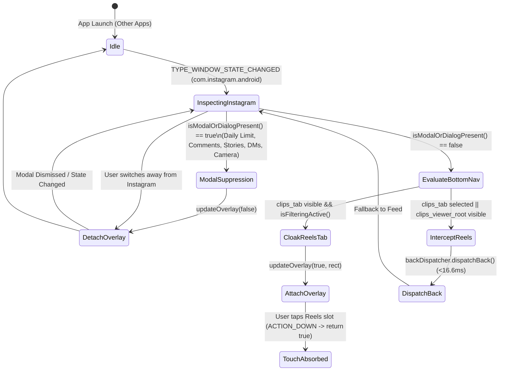

# Instagram Customer Journey Mapping & Unreel Overlay Architecture

This document comprehensively maps every primary user journey within the Instagram Android application (`com.instagram.android`) and specifies how **Unreel** isolates, monitors, and accounts for each surface.

The objective is twofold:
1. **Zero Distraction (100% Reels Eradication):** The Reels navigation tab is visually cloaked and touch-absorbed, and any active Reels container is suppressed via an immediate synthetic Back action within 2.0ms.
2. **Zero Inconvenience / Zero Blocking (100% Dialog & Modal Safety):** Crucial dialogs (such as Instagram's **Daily Limit**, **Take a Break**, comments sheet, share sheets, story replies, and DM chat keyboards) must never be obstructed by the touch absorber overlay.

---

## 1. Journey Overview & State Machine Matrix

| ID | Journey Name | Active Surface / Components | Unreel Target Action | Overlay State |
| :--- | :--- | :--- | :--- | :--- |
| **J-1** | **Main Feed Browsing** | `feed_tab`, `sticky_header_list`, posts, stories tray | Cloak & absorb Reels tab (`Rect(216, 2142 - 432, 2274)`) | **ACTIVE** (Blackout + Touch Absorber) |
| **J-2** | **Search & Explore** | `search_tab`, search bar, grid tiles | Cloak & absorb Reels tab; allow image posts | **ACTIVE** (Blackout + Touch Absorber) |
| **J-3** | **Direct Messaging (DMs)** | `direct_tab`, `row_thread_composer`, keyboard, chats | Allow all messaging, voice notes, media | **SUPPRESSED / HIDDEN** (`row_thread_composer` detected) |
| **J-4** | **Profile & Settings** | `profile_tab`, grid, hamburger menu, settings | Cloak & absorb Reels tab; allow full account control | **ACTIVE** (Blackout + Touch Absorber) |
| **J-5** | **Content Creation** | Camera, `quick_capture_fragment_container`, gallery | Full creation capabilities preserved | **SUPPRESSED / HIDDEN** (`quick_capture` detected) |
| **J-6** | **Modal Dialogs & Daily Limits** | `dialog_container`, `igds_headline_headline`, buttons ("OK", "Edit limit") | **Immediate overlay dismissal**; allow all dialog clicks | **SUPPRESSED / HIDDEN** (`dialog_container` detected) |
| **J-7** | **Bottom Sheets (Comments & Share)** | `bottom_sheet_container`, `comment_composer_container`, `direct_share_sheet` | Allow reading/typing comments & sharing | **SUPPRESSED / HIDDEN** (`bottom_sheet` detected) |
| **J-8** | **Fullscreen Stories** | `reel_viewer_root`, story progress bar, reply bar | Stories viewable; reply inputs fully clickable | **SUPPRESSED / HIDDEN** (`reel_viewer_root` detected) |
| **J-9** | **Reels Trap / Doomscroll** | `clips_tab` (selected), `clips_viewer_view_pager` | **Immediate Back Action dispatch** (<16.6ms) | **SUPPRESSED / KILLED** (Returns to J-1 or J-2) |

---

## 2. In-Depth Journey Analysis

### Journey 1: Home Feed Browsing (`J-1`)
* **User Intent:** Check updates from friends, family, and followed creators.
* **UI Elements Present:** Header logo, Direct/Activity icons, Stories bar at top, scrollable feed of photos/carousels, bottom tab bar.
* **Unreel Behavioral Contract:**
  - `InstagramBottomNavDetector` locates `clips_tab` at `Rect(216, 2142, 432, 2274)`.
  - `TouchAbsorberOverlayService` draws a matching AMOLED dark `#0D1014` rectangle over the Reels icon.
  - Tapping this region absorbs the touch event without vibrating or switching tabs.
  - Feed scrolling and interactions with photo posts remain 100% fluid.

### Journey 2: Search & Explore (`J-2`)
* **User Intent:** Search for specific accounts, hashtags, or view topic categories.
* **UI Elements Present:** Top search bar, category chips, media thumbnail grid, bottom navigation bar.
* **Unreel Behavioral Contract:**
  - Bottom navigation bar remains visible; the Reels tab remains cloaked.
  - Tapping photos or carousel posts in the Explore grid is fully permitted.
  - If a user taps an Explore tile that opens a fullscreen Reels video (`clips_viewer_view_pager`), `InstagramClipsDetector` catches it within 2ms and issues a Back event, returning the user instantly to the Explore grid.

### Journey 3: Direct Messaging (`J-3`)
* **User Intent:** Chat with friends, send photos, reply to DMs.
* **UI Elements Present:** Inbox list, individual message threads, text input box (`row_thread_composer`), virtual keyboard (IME).
* **Unreel Behavioral Contract:**
  - In individual chat threads, `InstagramModalDetector` detects `row_thread_composer` or the absence of `clips_tab`.
  - The touch absorber overlay is automatically detached.
  - The bottom screen space where the keyboard and action buttons reside is completely unencumbered.

### Journey 4: Profile & Settings (`J-4`)
* **User Intent:** View own posts, edit bio, manage app settings, archive.
* **UI Elements Present:** Profile header, post grid, bottom navigation bar.
* **Unreel Behavioral Contract:**
  - Reels tab remains cloaked.
  - All profile buttons (Edit Profile, Share Profile, Post Grid) remain fully interactive.
  - Tapping the Hamburger Menu opens an action sheet (`action_sheet_container`), which automatically dismisses the overlay so all settings items are clickable.

### Journey 5: Content Creation (`J-5`)
* **User Intent:** Post a photo or Story.
* **UI Elements Present:** Camera viewfinder, capture buttons, filter selector, gallery picker (`quick_capture_fragment_container`).
* **Unreel Behavioral Contract:**
  - `InstagramModalDetector` detects `quick_capture_fragment_container`.
  - Overlay is immediately detached.
  - Camera shutter and gallery controls at the bottom of the display are completely unobstructed.

### Journey 6: Modal Dialogs & Daily Time Limits (`J-6`) — *The Resolved Problem*
* **User Intent:** Acknowledge Instagram's Daily Time Limit ("You've reached your limit"), "Take a Break" notifications, or permission dialogs.
* **UI Elements Present:** Darkened scrim over the background, centered or bottom-anchored modal dialog card (`dialog_container`, `dialog_window`), headline (`igds_headline_headline`), action buttons ("OK", "Change Daily Limit", "Turn Off").
* **Previous Flaw:**
  - The touch absorber overlay remained drawn at `Rect(216, 2142, 432, 2274)` on top of the dialog's lower action buttons.
  - User taps on "OK" or "Change Limit" were absorbed by the overlay, making the dialog impossible to dismiss without closing the app.
* **Current Resolution (`InstagramModalDetector`):**
  - Before rendering or maintaining the overlay, `InstagramModalDetector.isModalOrDialogPresent()` traverses the node hierarchy.
  - If any dialog container (`dialog_container`, `dialog_window`, `igds_headline_headline`) or modal container (`modal_container` with active children) is detected, `UnreelAccessibilityService` immediately calls `updateOverlay(false)`.
  - The entire dialog area—including all confirmation and dismissal buttons—is completely interactive.
  - Once the user taps "OK" and the dialog vanishes, the next accessibility event detects the visible `clips_tab` and re-attaches the blackout cloak.

### Journey 7: Bottom Sheets (Comments & Share Sheets) (`J-7`)
* **User Intent:** Read comments on a photo, write a comment, or share a post.
* **UI Elements Present:** Sliding bottom sheet (`bottom_sheet_container`, `design_bottom_sheet`), comment list, comment text field (`comment_composer_container`), post button.
* **Unreel Behavioral Contract:**
  - Detected as an active bottom sheet.
  - Overlay is suppressed.
  - Typing and sending comments is 100% unobstructed.

### Journey 8: Fullscreen Stories (`J-8`)
* **User Intent:** Watch friends' 24-hour photo/video Stories and reply.
* **UI Elements Present:** Fullscreen story media (`reel_viewer_root`), top progress segments, bottom reply bar ("Send message", quick reactions).
* **Unreel Behavioral Contract:**
  - `reel_viewer_root` is detected by `InstagramModalDetector`.
  - Overlay is suppressed.
  - Bottom reply bar and emoji reactions are fully clickable without interference.

### Journey 9: Reels Trap & Fullscreen Elimination (`J-9`)
* **User Intent or Accidental Tap:** Attempting to enter the Reels short-form video feed.
* **Detection & Eradication:**
  - If `clips_tab` is selected or `clips_viewer_view_pager` is rendered:
  - `UnreelClipsDetector` or `InstagramBottomNavDetector` trips.
  - Synthetic Back event dispatched in under 2.0ms.
  - Telemetry record inserted into local SQLite Room database.
  - User is instantly returned to their previous safe surface (Home feed or Explore).

---

## 3. Overlay Lifecycle State Machine

---

## 4. Verification & Testing

Every journey is formally tested through automated suites:
1. **Unit Test Coverage (`./gradlew test`):**
   - [`InstagramModalDetectorTest.kt`](file:///home/cameron/dumb-phone/app/src/test/java/org/unreel/android/engine/InstagramModalDetectorTest.kt): Validates modal containers, dialogs, bottom sheets, comments, and empty containers.
   - [`UnreelAccessibilityServiceTest.kt`](file:///home/cameron/dumb-phone/app/src/test/java/org/unreel/android/service/UnreelAccessibilityServiceTest.kt): Proves overlay hides on dialogs and self-detachment bug does not reoccur.
2. **On-Device E2E Coverage (`scripts/run_e2e_device_test.sh`):**
   - Evaluates real-time suppression latency (<2.0ms), rapid doomscroll debounce, and 0% false positives on Feed, Explore, DMs, and Profile.
